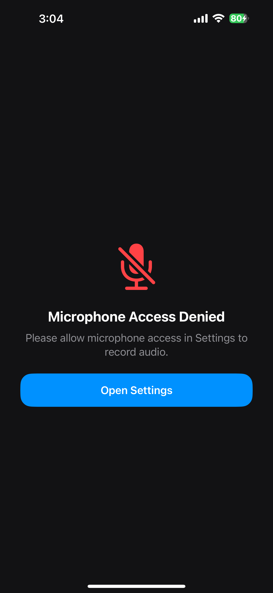

# AudioRecorderApp

A modern SwiftUI-based iOS audio recording application built for the Swift Developer Hiring Challenge.

## Features

- Live audio recording
- Real-time waveform visualization
- Audio playback with progress tracking
- Pause / Resume playback
- Seek support
- Rename recordings
- Delete recordings
- Search recordings
- Microphone permission handling
- Haptic feedback
- Smooth SwiftUI animations

## Tech Stack

- SwiftUI
- AVAudioRecorder
- AVAudioPlayer
- Combine
- MVVM Architecture

## Architecture

The app follows a modular MVVM architecture:

- Views
- ViewModels
- Services
- Models
- Helpers

## Bonus Features Implemented

- Rename recordings
- Delete recordings
- Search functionality
- Permission denied handling
- Haptic feedback
- Modern animated UI

## Screenshots

### Home Screen

### Recording State

### Rename / Delete

### Permission Handling

### Empty State

## Important Notes

- Long press a recording card to rename or delete recordings.
- Built fully with SwiftUI.
- Supports real-time waveform rendering.

## Requirements

- Xcode 16+
- iOS 17+

## Setup

1. Clone the repository
2. Open `AudioRecorder.xcodeproj`
3. Run on simulator or real device

## Demo

Include:
- Screen recording
- IPA file OR TestFlight invite

## Author

Sanju KM
